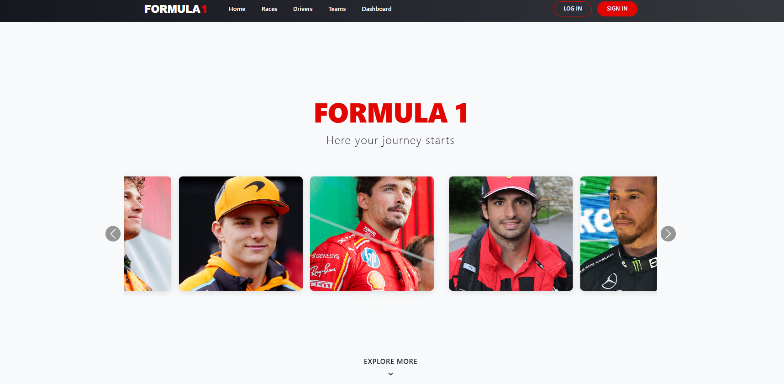

Hi everyone, this is my first big project that I've been doing for quite a while, because I've been abandoning it for a while because I didn't have enough time, but I wanted to finish this site before the start of the 2025 season. The idea was a smaller project, but it turned out to be several pages long. I wrote the entire backend part myself using Flask + SQLAlchemy (Database), and decided to “test” the frontend part with AI, and Cloud sonnet 3.7 turned out to be the best and most developed - it's a really fantastic machine for creating websites. I made the design in the canvas and received the code from AI.

The goal of the project was to create a website about the royal races and the ability to place your bets, follow each driver during the season, follow the calendar, and track your own position in the user grid.

