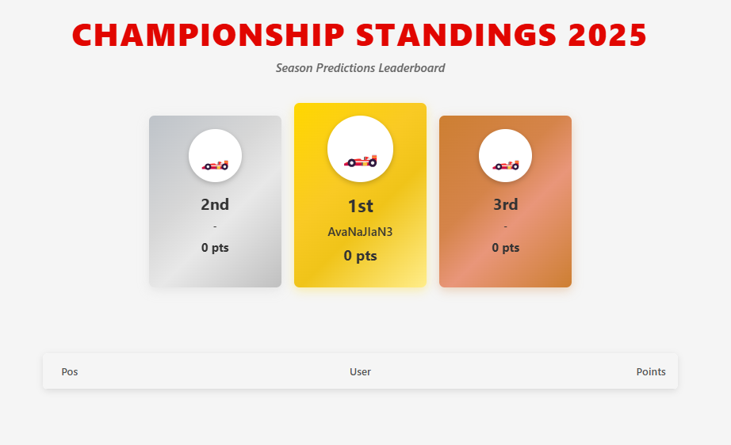

Important!!! I USED ALL THE PHOTOS OF DRIVERS AND TEAMS FROM THE WIKI SITE, WHERE THE PHOTOS WERE FREELY AVAILABLE. 
ALL IMAGE CREDITS (links to photos) are in CREDITS.txt
Important!!! This is an educational project and is not affiliated with Formula 1 or any of its partners. This website is unofficial and is not associated in any way with the Formula 1 companies. 
F1, FORMULA ONE, FORMULA 1, FIA FORMULA ONE WORLD CHAMPIONSHIP, GRAND PRIX and related marks are trade marks of Formula One Licensing B.V All trademarks are property of their respective owners.
(I love F1)

Hi everyone, this is my first big project that I've been doing for quite a while, because I've been abandoning it for a while because I didn't have enough time, but I wanted to finish this site before the start of the 2025 season. The idea was a smaller project, but it turned out to be several pages long. I wrote the entire backend part myself using Flask + SQLAlchemy (Database), and decided to “test” the frontend part with AI, and Cloud sonnet 3.7 turned out to be the best and most developed - it's a really fantastic machine for creating websites. I made the design in the canvas and received the code from AI.
The goal of the project was to create a website about the royal races and the ability to place your bets, follow each driver during the season, follow the calendar, and track your own position in the user grid.
**Home page**

Here we can see a carousel with photos of the riders for the current 2025 season, you can click on each one and easily go to their profile

**Racer profile**

Each driver has their own career point total and basic information + biography

**User profile**

Here we see the number of our points and our predictions for this season

**Race Predictions**

On this page, we can select any race (which has not yet ended, or the user has not yet made a prediction) and select the top ten riders. 
For the first place, if the user guessed correctly, he/she gets 10 points and then summed up for each corrected place

**Dashboard**

Here we can see a table of all participants who are registered and participating in the competition. 
The first, second, and third places have their own separate style

**Racers**

Depending on the points, we can see the sequence of drivers

**Add predictions**

Results are added manually using the Restful API. The main arguments are :
"Driver Time"
"Race Id"
"Driver Place"
"Driver Id"
"Score"
After entering the value, the points of the driver, teams (in case of getting into the top 10) and the user's points if he guessed the place of the driver are automatically updated.

## Technolgoies 🛠
- Python
- Flask
- HTML, CSS, JavaScript
- SQLAlchemy (+SQLite to browser my DB)
- AI :D (cloude sonnet 3.7) 

This is my first project, so there may be a lot of mistakes, but if you have any suggestions, ideas on how to fix it or make it better, write to me!